# Python期末大作业

班级: 2021211308

学号: 2021211391

姓名: 吴显科


1. ### 城市列表与数据情况

   北京, 上海, 广州, 深圳, 成都

   表头: 名称, 区域, 板块, 房型, 朝向, 面积(平米), 价格(元/月), 单位面积价格(元/平米/月)

   data/bj.csv  36621pieces

   data/sh.csv 30003 pieces

   data/gz.csv 30538 pieces

   data/sz.csv 23647 pieces

   data/cd.csv 33539 pieces

   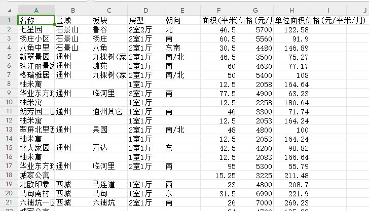

2. ### 爬虫设计: 

   1. 使用了面向对象设计, 设计基类BasicSpider, 通过继承分别得到爬虫bj/sh/gz/sz/cd

   2. 在BasicSpider类中, 覆写了parse方法, 通过css selector获取".content__list--item"中的元素(包含了单一房源的全部信息)后, 调用parse_item方法进行后续处理. 处理结束后, 使用index更新url, 达到爬取连续爬取网页的效果

      ```py
      def parse(self, response):
          for each in response.css(".content__list--item"):
              item = self.parse_item(each)
              yield item
      
          location = response.url.split("/")[4]
          idx = self.index[location]
          if idx <= 100:
              time.sleep(1)
              next_page = self.prefix + location + "/pg" + str(idx) + "/" + "#contentList"
              self.index[location] += 1
              yield scrapy.Request(next_page, callback=self.parse)
          else:
              return None
      ```

   3. 覆写了方法parse_item, 进行下列处理

      名称: 舍去前三个字符

      房型: 匹配含有"室"或"房间"的数据, 否则置空

      朝向: 限制字数在[1,3]之间, 并要求只包含"东南西北"四种字符

      区域&板块: 通过进一步使用css selector获取("p.content__list--item--des a::text")中的数据, 按序将其分离

      面积: 筛选包含㎡的数据, 否则置空

      价格&单位面积价格: 正常使用css selector获取

      ```py
      def parse_item(self, selector):
          item = BasicItem()
          info = selector.css(
              "a.content__list--item--aside[title]::attr(title)"
          ).extract_first()
          info_list = info.split(" ")
          item["名称"] = info_list[0][3:]
      
          typeList = [s for s in info_list if "室" in s or "房间" in s]
          item["房型"] = typeList[0] if len(typeList) > 0 else ""
      
          orientationList = [
              s
              for s in info_list
              if len(s) in range(1, 4) and ("东" in s or "南" in s or "西" in s or "北" in s)
          ]
          item["朝向"] = orientationList[0] if len(orientationList) > 0 else ""
      
          info = selector.css("p.content__list--item--des a::text").getall()
          if len(info) > 2:
              item["区域"] = info[0]
              item["板块"] = info[1]
          else:
              item["区域"] = ""
              item["板块"] = ""
      
          info = selector.css("p.content__list--item--des ::text").getall()
          areaList = [s for s in info if "㎡" in s]
          item["面积"] = areaList[0].strip() if len(areaList) > 0 else ""
      
          item["价格"] = selector.css("span.content__list--item-price em::text").get()
          item["单位面积价格"] = ""
          return item
      ```

   4. 在具体的城市爬虫中, 继承basicSpider, 并按需设置start_urls(按区抓取以突破一百页限制), 并设置prefix, index等自动抓取所需参数, 这里用北京举例:

      ```py
      class BjSpider(basicSpider.BasicSpider):
          name = "bj"
          allowed_domains = ["bj.lianjia.com"]
          start_urls = [
              "https://bj.lianjia.com/zufang/dongcheng/",
              "https://bj.lianjia.com/zufang/xicheng/",
              "https://bj.lianjia.com/zufang/chaoyang/",
              "https://bj.lianjia.com/zufang/haidian/",
              "https://bj.lianjia.com/zufang/fengtai/",
              "https://bj.lianjia.com/zufang/shijingshan/",
              "https://bj.lianjia.com/zufang/tongzhou/",
              "https://bj.lianjia.com/zufang/changping/",
              "https://bj.lianjia.com/zufang/daxing/",
              "https://bj.lianjia.com/zufang/yizhuangkaifaqu/",
              "https://bj.lianjia.com/zufang/shunyi/",
              "https://bj.lianjia.com/zufang/fangshan/",
              "https://bj.lianjia.com/zufang/mentougou/",
              "https://bj.lianjia.com/zufang/pinggu/",
              "https://bj.lianjia.com/zufang/huairou/",
              "https://bj.lianjia.com/zufang/miyun/",
              "https://bj.lianjia.com/zufang/yanqing/",
          ]
          index = {
              "dongcheng": 2,
              "xicheng": 2,
              "chaoyang": 2,
              "haidian": 2,
              "fengtai": 2,
              "shijingshan": 2,
              "tongzhou": 2,
              "changping": 2,
              "daxing": 2,
              "yizhuangkaifaqu": 2,
              "shunyi": 2,
              "fangshan": 2,
              "mentougou": 2,
              "pinggu": 2,
              "huairou": 2,
              "miyun": 2,
              "yanqing": 2,
          }
          prefix = "https://bj.lianjia.com/zufang/"
      ```

3. ### 总体房租对比

1. data_analyse/overall/overall_DataAnalyzer.py: 从数据中获取数据, 并计算出租金的均价、最高价、最低价、中位数, 以及单位面积租金（元/平米）的均价、最高价、最低价、中位数	

```py
    def calculate_statistics(self):
        # Calculating statistics for 价格(元/月) and 单位面积价格(元/平米/月)
        price_stats = self.data["价格(元/月)"].describe(percentiles=[0.5])
        unit_price_stats = self.data["单位面积价格(元/平米/月)"].describe(percentiles=[0.5])

        # Extracting required statistics
        self.price_summary = {
            "价格均价": int(price_stats["mean"]),
            "价格最高价": int(price_stats["max"]),
            "价格最低价": int(price_stats["min"]),
            "价格中位数": int(price_stats["50%"]),
        }

        self.unit_price_summary = {
            "单位面积价格均价": round(unit_price_stats["mean"], 2),
            "单位面积价格最高价": round(unit_price_stats["max"], 2),
            "单位面积价格最低价": round(unit_price_stats["min"], 2),
            "单位面积价格中位数": round(unit_price_stats["50%"], 2),
        }
```

2. data_analyse/overall/overall_visulization.py: 分别调用上述代码进行计算五个城市的数据, 以租金/单位面积租金为区分, 分别作四个柱状图, 分别展示五个成熟的均价/最高价/最低价/中位数信息

```py
unit_price_summaries = [
    BJ.get_unit_price_summary(),
    SH.get_unit_price_summary(),
    GZ.get_unit_price_summary(),
    SZ.get_unit_price_summary(),
    CD.get_unit_price_summary(),
]

# 提取绘图所需的值
means = [summary["单位面积价格均价"] for summary in unit_price_summaries]
maxes = [summary["单位面积价格最高价"] for summary in unit_price_summaries]
mins = [summary["单位面积价格最低价"] for summary in unit_price_summaries]
medians = [summary["单位面积价格中位数"] for summary in unit_price_summaries]
categories = ["北京", "上海", "广州", "深圳", "成都"]
colors = [
    "#" + "".join([random.choice("0123456789ABCDEF") for j in range(6)])
    for i in range(len(categories))
]
plt.rcParams["font.sans-serif"] = ["SimHei"]
plt.rcParams["axes.unicode_minus"] = False

# 绘制均价条形图
plt.figure(figsize=(10, 6))
bars = plt.bar(categories, means, color=colors)
for bar in bars:
    yval = bar.get_height()
    plt.text(
        bar.get_x() + bar.get_width() / 2,
        yval,
        round(yval, 2),
        va="bottom",
        ha="center",
    )
plt.xlabel("城市")
plt.ylabel("均价 (元/平米/月)")
plt.title("各城市单位面积房价均价对比")
plt.show()
```

#### 总体房租可视化图: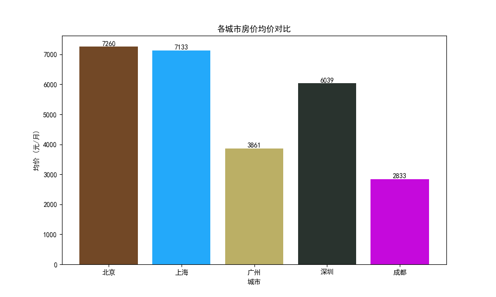

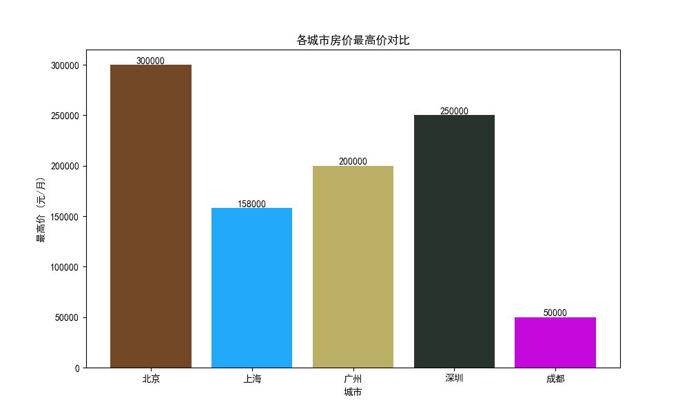

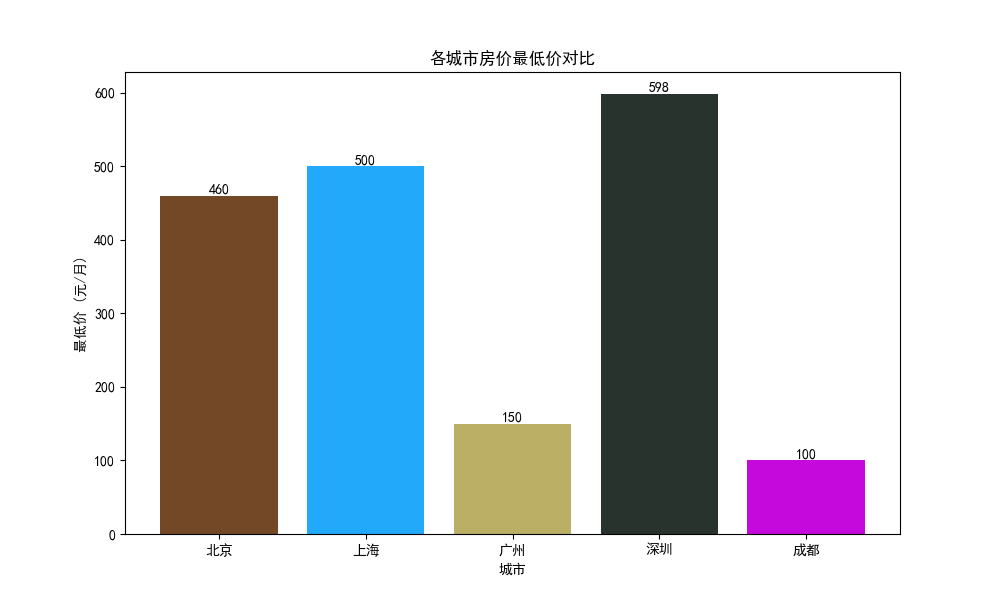

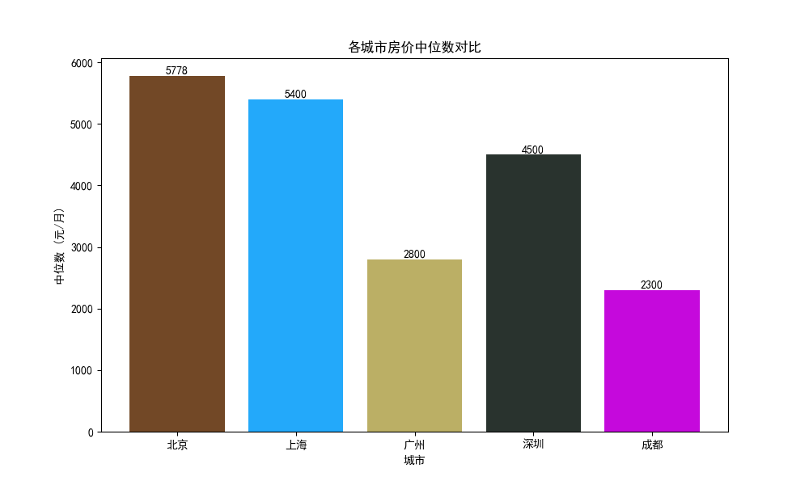

#### 单位面积房租可视化图:

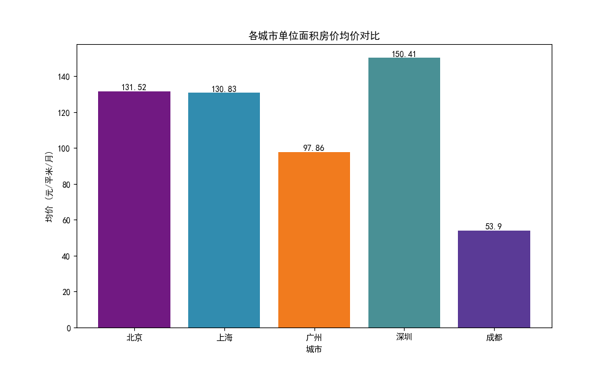


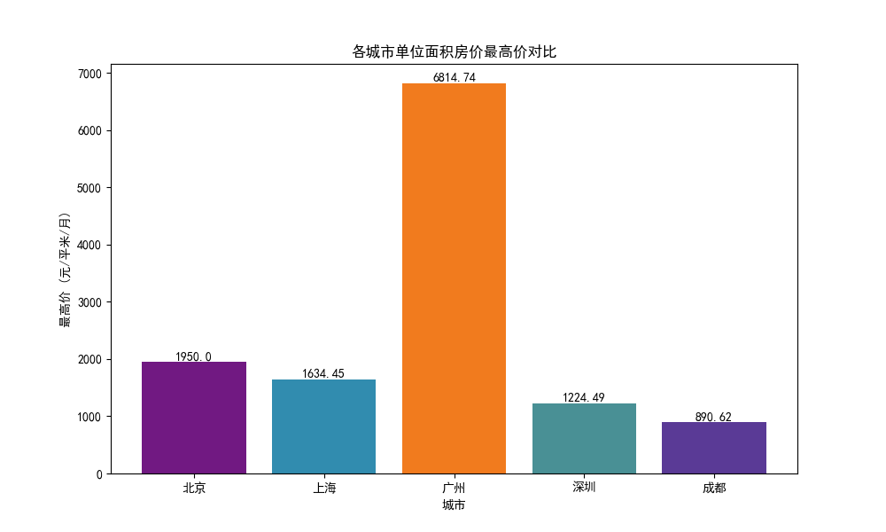


4. ### 比较居室情况

   1. 清洗数据, 获取有数字, 且居室数在1,2,3的数据

      ```py
      def clean_data(self):
          # Cleaning the data
          self.data.dropna(subset=["房型"], inplace=True)
          self.data["室的数量"] = self.data["房型"].str.extract(r"(\d+)室")
          # Remove rows where room number extraction failed
          self.data.dropna(subset=["室的数量"], inplace=True)
          self.data["室的数量"] = self.data["室的数量"].astype(int)
          # Filtering for 1, 2, and 3 rooms only
          self.data = self.data[self.data["室的数量"].isin([1, 2, 3])]
      ```

   2. 计算均价/最高价/最低价/中位数, 并存储

      ```py
      def group_data(self):
          # Grouping the data and calculating statistics
          grouped_data_cleaned = self.data.groupby("室的数量")["价格(元/月)"].agg(
              ["mean", "max", "min", "median"]
          )
          grouped_data_cleaned.columns = ["平均价格", "最高价格", "最低价格", "中位数"]
          grouped_data_cleaned.reset_index(inplace=True)
          self.grouped_data_cleaned = grouped_data_cleaned
      ```

   3. 按室的多少分类, 在每张图中分别展示五个城市的均价/最高价/最低价/中位数

      ```py
      def plot_grouped_comparison_for_room(rooms, room_number, title):
          # Setting the positions and width for the bars
          pos = list(range(len(rooms)))
          width = 0.2
      
          plt.rcParams["font.sans-serif"] = ["SimHei"]
          plt.rcParams["axes.unicode_minus"] = False
      
          fig, ax = plt.subplots(figsize=(15, 8))
          labels = ["北京", "上海", "深圳", "广州", "成都"]
      
          # Creating bars for each metric
          for i, metric in enumerate(["平均价格", "最高价格", "最低价格", "中位数"]):
              values = [
                  room.grouped_data_cleaned[room.grouped_data_cleaned["室的数量"] == room_number][
                      metric
                  ].mean()
                  for room in rooms
              ]
              bars = ax.bar([p + width * i for p in pos], values, width, label=metric)
      
              # Adding the data labels on top of the bars
              for bar in bars:
                  yval = bar.get_height()
                  ax.text(
                      bar.get_x() + bar.get_width() / 2,
                      yval,
                      round(yval, 2),
                      va="bottom",
                      ha="center",
                      fontsize=8,
                  )
      
          # Setting the x-axis labels, title, legend, and adjusting layout
          ax.set_xticks([p + 1.5 * width for p in pos])
          ax.set_xticklabels(labels)
          ax.set_title(f"{title}（{room_number}室）")
          ax.legend(loc="upper left")
          plt.ylabel("价格 (元)")
          plt.tight_layout()
          plt.show()
      ```

      

      

      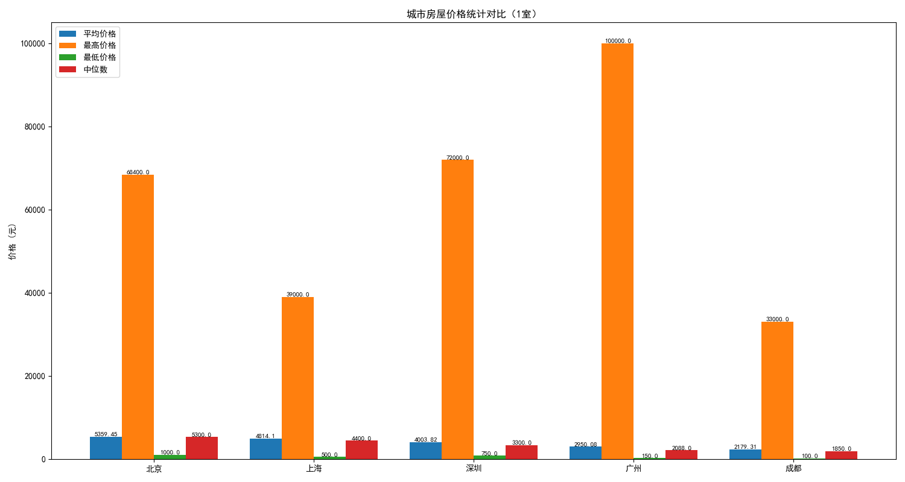

5. ### 比较板块情况

1. 因为在爬虫pipeline中进行了预处理, 可以直接使用数据

2. 计算均价并降序排序:

   ```py
   # 读取 CSV 文件
   data = pd.read_csv(file_path)
   
   # 根据板块分组并计算每个板块的平均价格
   average_prices_by_area = data.groupby("板块")["价格(元/月)"].mean().reset_index()
   
   # 按平均价格降序排序
   sorted_average_prices = average_prices_by_area.sort_values(
       by="价格(元/月)", ascending=False
   )
   ```

3. 生成五张图, 对应五个城市, 每张图展示所有板块及其均价

   ```py
       plt.rcParams.update({"font.size": 5})
       plt.rcParams["font.sans-serif"] = ["SimHei"]
       plt.rcParams["axes.unicode_minus"] = False
       plt.figure(figsize=(18, 8))
       bars = plt.bar(
           sorted_average_prices["板块"], sorted_average_prices["价格(元/月)"], color="skyblue"
       )
   
       plt.xlabel("板块")
       plt.ylabel("平均价格(元/月)")
       plt.title("各板块的平均租金价格")
       plt.xticks(rotation=90)
       plt.tight_layout()
       plt.show()
   ```

   北京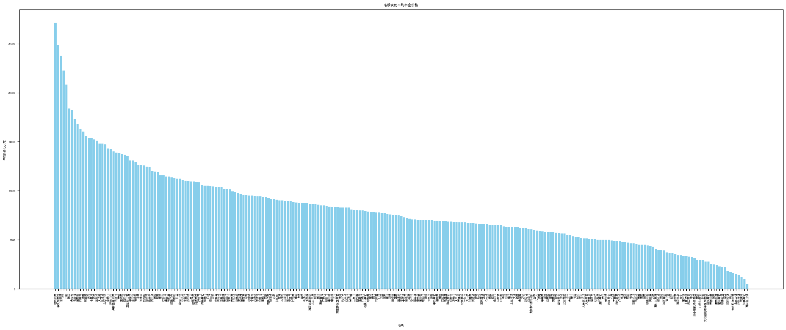

   上海

​	广州	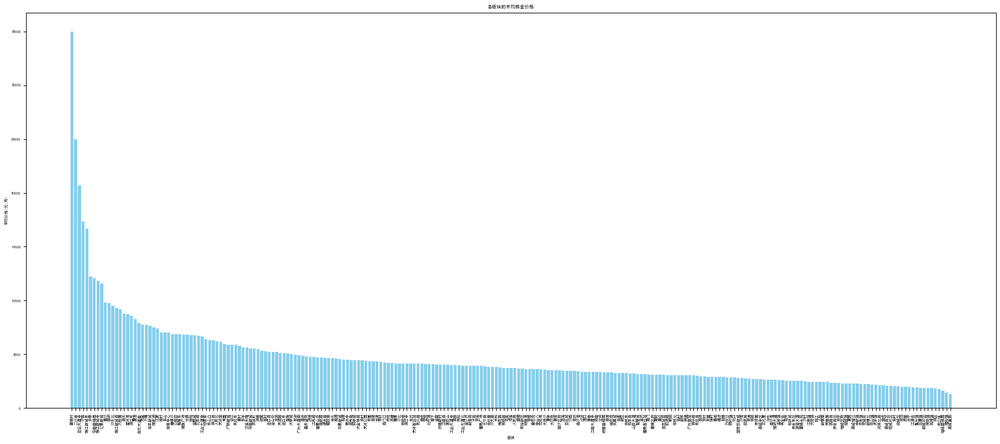

​	深圳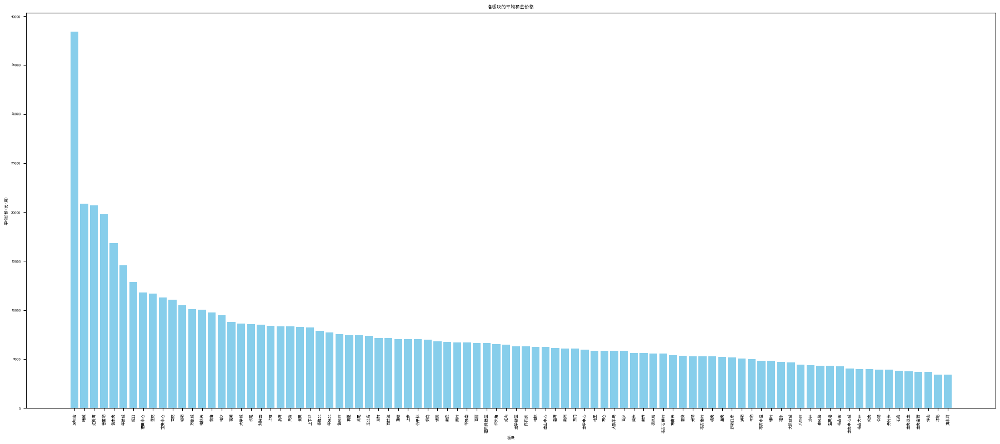

​	成都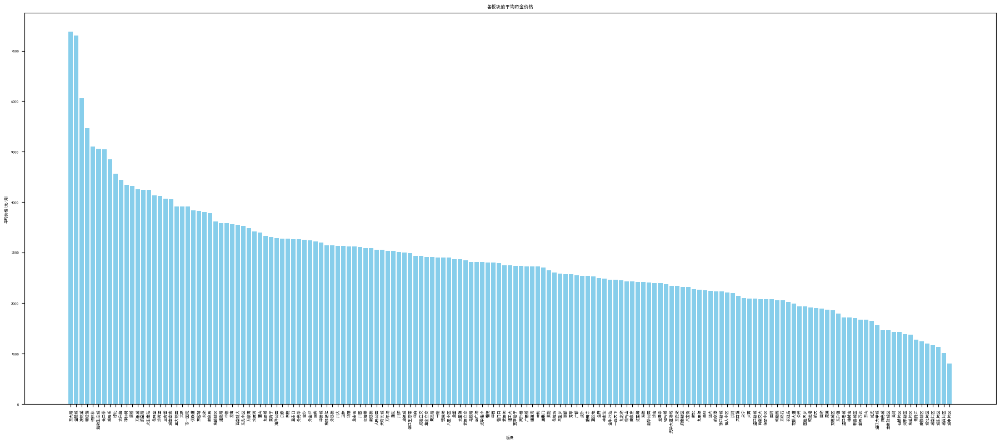


6. ### 朝向比较

   1. 设置合法朝向为"东南西北", 进行数据清洗并结合单位面积价格进行分组

      ```py
      def analyze_rent_data(file_path):
          # Load the data
          data = pd.read_csv(file_path)
      
          # Remove rows with missing data
          data_clean = data.dropna()
      
          # Keep only rows with a single direction in the orientation (朝向) column
          valid_directions = ["东", "南", "西", "北"]
          data_clean = data_clean[data_clean["朝向"].isin(valid_directions)]
      
          # Calculate and return the average unit area rent for each direction
          return data_clean.groupby("朝向")["单位面积价格(元/平米/月)"].mean()
      ```

   2. 计算各个城市最高价方向和最低价方向, 并可视化

      ```py
      def plot_rent_directions(cities_data):
          highest_rent_directions = {}
          lowest_rent_directions = {}
      
          for city, data in cities_data.items():
              highest_rent_direction = data.idxmax()
              lowest_rent_direction = data.idxmin()
              highest_rent_directions[city] = (
                  highest_rent_direction,
                  data[highest_rent_direction],
              )
              lowest_rent_directions[city] = (
                  lowest_rent_direction,
                  data[lowest_rent_direction],
              )
          plt.rcParams["font.sans-serif"] = ["SimHei"]
          plt.rcParams["axes.unicode_minus"] = False
      
          # Plotting the highest average rent directions
          plt.figure(figsize=(10, 5))
          plt.title("各城市最高平均单位租金朝向")
          for city, (direction, rent) in highest_rent_directions.items():
              plt.bar(city, rent, label=f"{direction} ({rent:.2f}/㎡/month)")
          plt.ylabel("平均单位租金 (元/㎡/month)")
          plt.legend()
          plt.show()
      
          # Plotting the lowest average rent directions
          plt.figure(figsize=(10, 5))
          plt.title("各城市最低平均租金朝向")
          for city, (direction, rent) in lowest_rent_directions.items():
              plt.bar(city, rent, label=f"{direction} ({rent:.2f}/㎡/month)")
          plt.ylabel("平均单位租金 (元/㎡/month)")
          plt.legend()
          plt.show()
      ```

   3. 图表展示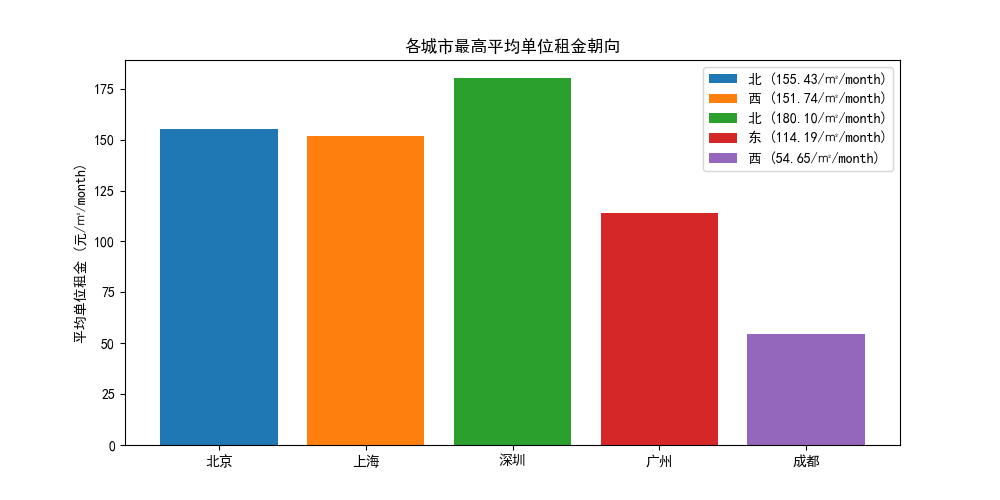

   4. 分析: 各个城市并不一致, 我认为该数据与当地的纬度及太阳朝向有关

7. ### 人均GDP与单位面积租金的关系

   1. 上网查询各地的人均GDP

   2. 计算人均GDP与各地房租的比值, 记为GDP可租住面积, 记录频数生成GDP可租住面积分布图, 通过查看高频面积区间来判断该城市的生活压力

      ```py
       GDP = {
              "北京": 190000,
              "上海": 180000,
              "广州": 150000,
              "深圳": 180000,
              "成都": 100000,
          }
          gdp_per_capita = GDP[city_name]  # in Yuan
      
          # Calculating the number of square meters of housing that can be afforded for a year with the GDP
          data["affordable_area_sqm"] = gdp_per_capita / (data["单位面积价格(元/平米/月)"] * 12)
      
          # Removing extreme points (outliers) for a clearer view
          # Using the Interquartile Range (IQR) method to identify outliers
          Q1 = data["affordable_area_sqm"].quantile(0.25)
          Q3 = data["affordable_area_sqm"].quantile(0.75)
          IQR = Q3 - Q1
      
          # Defining outliers as points outside of Q1 - 1.5*IQR and Q3 + 1.5*IQR
          lower_bound = Q1 - 1.5 * IQR
          upper_bound = Q3 + 1.5 * IQR
      
          # Filtering the data to exclude outliers
          filtered_data = data[
              (data["affordable_area_sqm"] >= lower_bound)
              & (data["affordable_area_sqm"] <= upper_bound)
          ]
      
          # Creating a histogram to show the distribution of affordable housing area
          plt.rcParams["font.sans-serif"] = ["SimHei"]
          plt.rcParams["axes.unicode_minus"] = False
      
          plt.figure(figsize=(10, 6))
          plt.hist(
              filtered_data["affordable_area_sqm"],
              bins=30,
              color="skyblue",
              edgecolor="black",
          )
      
          # Adding value labels to each bar
          for rect in plt.gca().patches:
              height = rect.get_height()
              plt.gca().text(
                  rect.get_x() + rect.get_width() / 2,
                  height + 5,
                  f"{int(height)}",
                  ha="center",
                  va="bottom",
              )
      
          plt.title(f"{city_name}GDP可租住面积分布图")
          plt.xlabel("面积(平方米)")
          plt.ylabel("频数")
          plt.grid(True)
          plt.show()
      ```

   3. 图表展示:	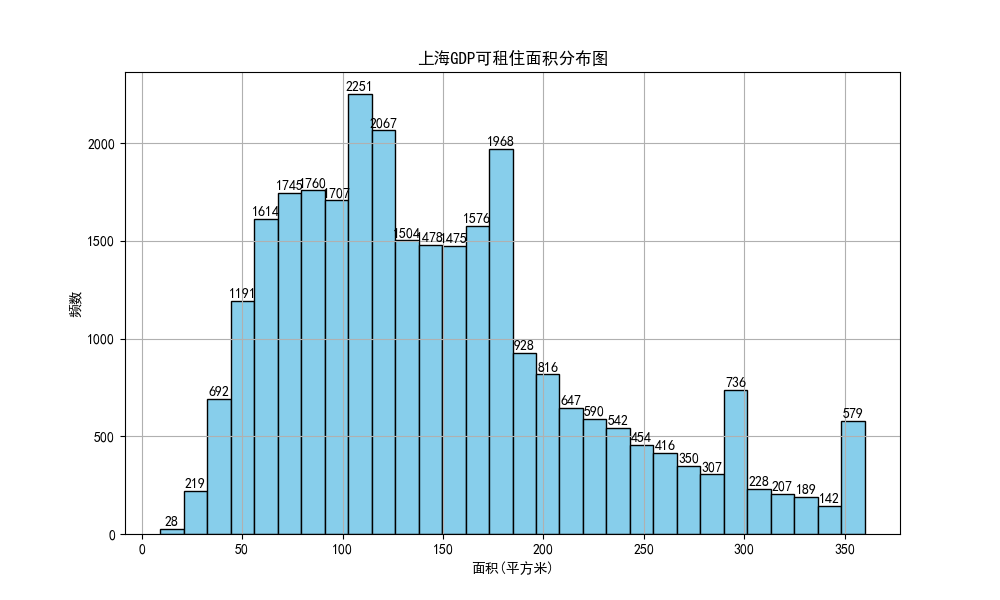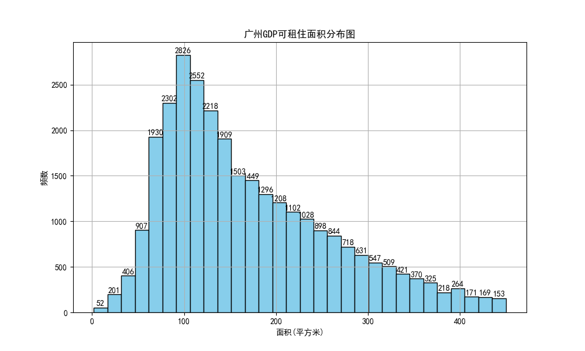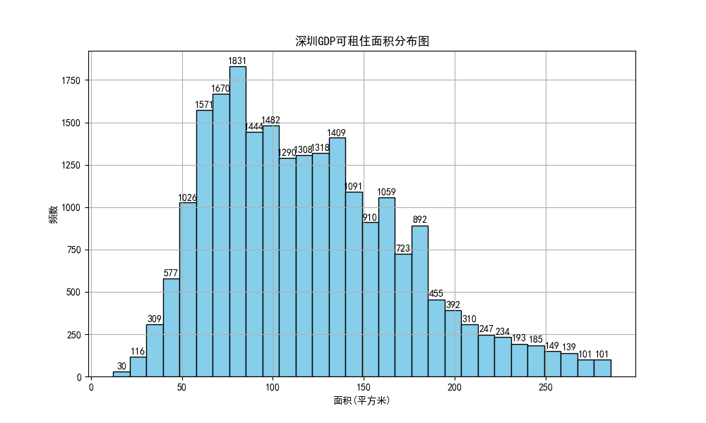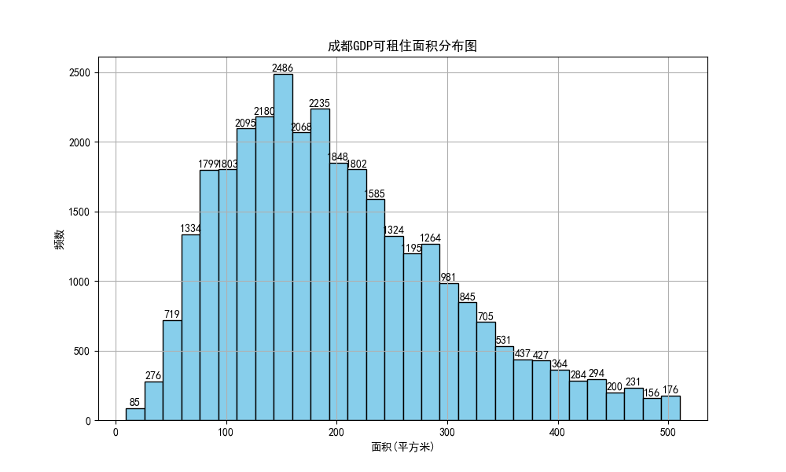

   4. 分析: 查看图表可知, 成都的可居住面积较高, 因此在成都租房性价比较高

8. ### 平均工资与单位面积租金

   1. 获取各地的平均工资

   2. 按国际惯例, 使用30%工资进行租房较为合理, 因此计算30%工资在当地可以租到的平方数, 通过面积数据体现当地租房压力

      ```py
      def analyze_housing_affordability_salary(file_path, city_name):
          # Load the CSV file
          data = pd.read_csv(file_path)
          salarys = {
              "北京": 13930,
              "上海": 13832,
              "广州": 11710,
              "深圳": 13086,
              "成都": 10039,
          }
          # Calculating the number of square meters of housing that can be afforded for a year with the average salary
          data["affordable_area_sqm"] = 0.3 * salarys[city_name] / (data["单位面积价格(元/平米/月)"])
      
          # Removing extreme points (outliers) for a clearer view
          # Using the Interquartile Range (IQR) method to identify outliers
          Q1 = data["affordable_area_sqm"].quantile(0.25)
          Q3 = data["affordable_area_sqm"].quantile(0.75)
          IQR = Q3 - Q1
      
          # Defining outliers as points outside of Q1 - 1.5*IQR and Q3 + 1.5*IQR
          lower_bound = Q1 - 1.5 * IQR
          upper_bound = Q3 + 1.5 * IQR
      
          # Filtering the data to exclude outliers
          filtered_data = data[
              (data["affordable_area_sqm"] >= lower_bound)
              & (data["affordable_area_sqm"] <= upper_bound)
          ]
      
          # Creating a histogram to show the distribution of affordable housing area based on average salary
          plt.rcParams["font.sans-serif"] = ["SimHei"]
          plt.rcParams["axes.unicode_minus"] = False
          plt.figure(figsize=(10, 6))
          plt.hist(
              filtered_data["affordable_area_sqm"],
              bins=30,
              color="skyblue",
              edgecolor="black",
          )
          plt.title(f"{city_name}地区30%平均工资可负担的房屋面积分布")
          plt.xlabel("面积(㎡)")
          plt.ylabel("频数")
          plt.grid(True)
          plt.show()
      ```

   3. 图表展示

      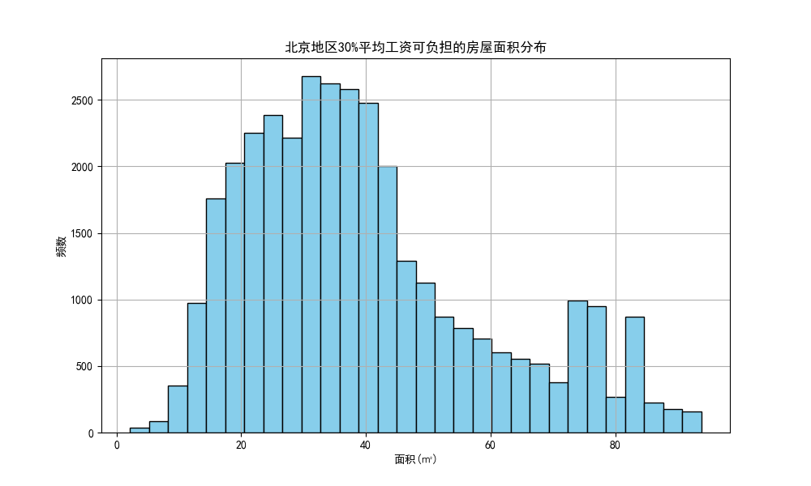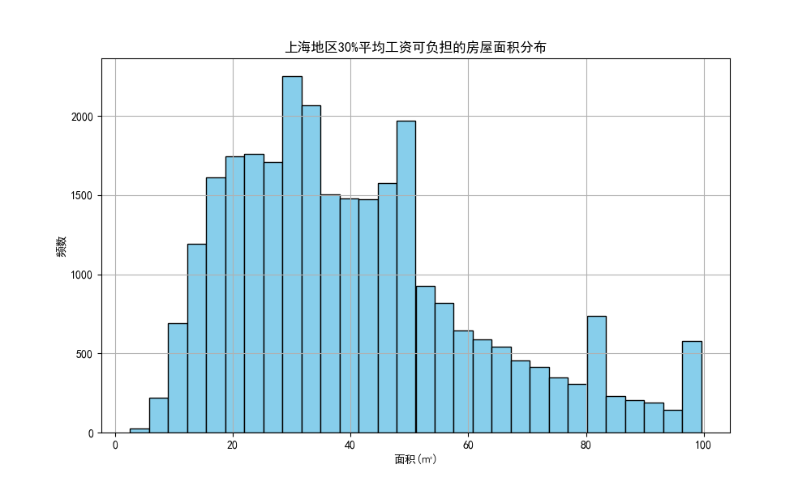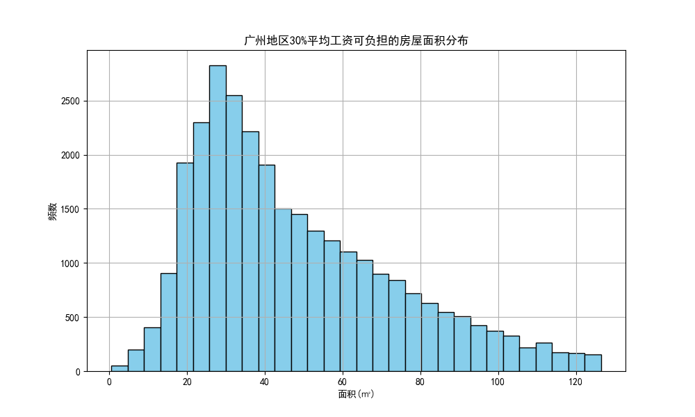

      ![广州](./assets/广州-1702548389577-44.png

      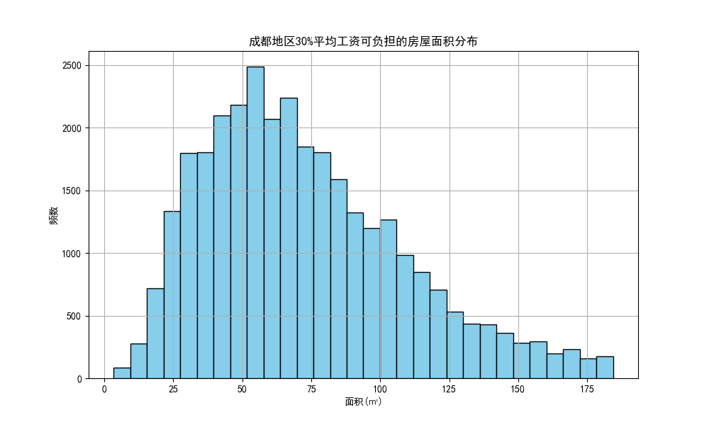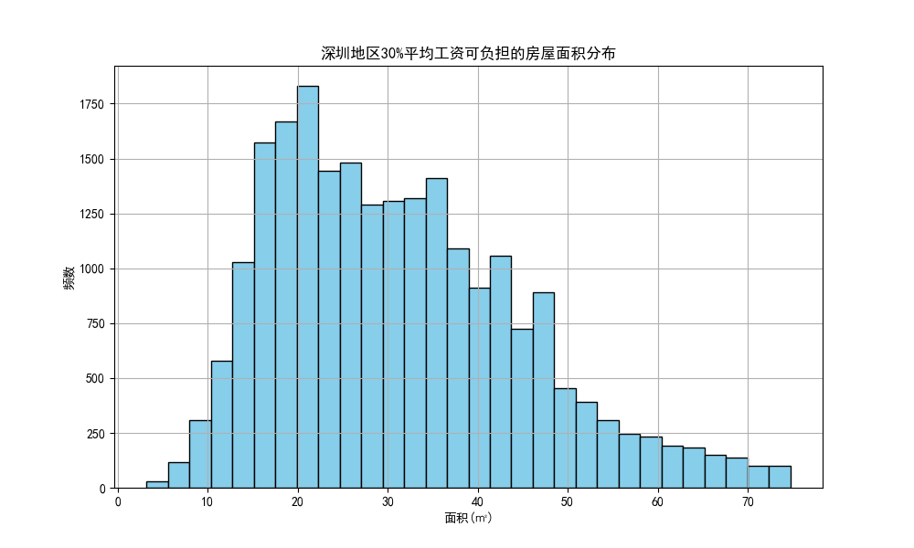

   4. 读图分析可知, 在成都, 使用平均工资30%可租住的房子面积最大, 租房负担最小